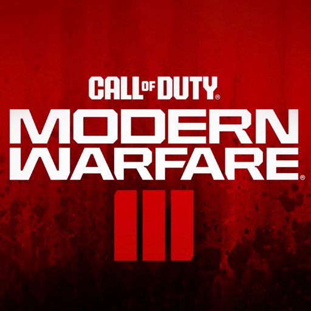

    

# Hello there, fellow 🧑‍🚀!

If I could write code instead of sleeping, eating or `*insert any activity*` here believe me I would. Sadly, we're limited and my brain needs some rest 😆. I am really passionate about the Astro and React ecosystems and do my best every day to find tools that make my job easier and/or better.

## Whenever I start a new project I always end up using

       

## Career Stats

- 🪖 Worked on websites since 2022
- 🐝 Started my freelance business in 2024
- 🤝 Started contributing to Open Source in 2024

## Projects I have worked on

### Create: Unlimited Wiki

Create: Unlimited was the first open source project I've contributed to. As a part-time Minecraft gamer, I found this mod extremely useful and thought that it was a great improvement if there was a place where you could find more information about it.

### Transylvania College

Transylvania College is an international school located in Romania. At first I was hired to work in the marketing team but soon realized that I have a brain oriented towards more technical stuff 🧠 I ended up re-writing the whole site, linked it manually with a CRM and many more 😆

## I look forward to making

- 🌤️ **_A mental-health tracking/enhancing app._**  
  I don't intend on making the next AI psychologist because I think psychologists have a really important place in the world but I'd love if some sort of app that would complement therapy really well existed.

## My music playlists

> **_Click the thumbnail_** and let me know your thoughts 😉

## My games

